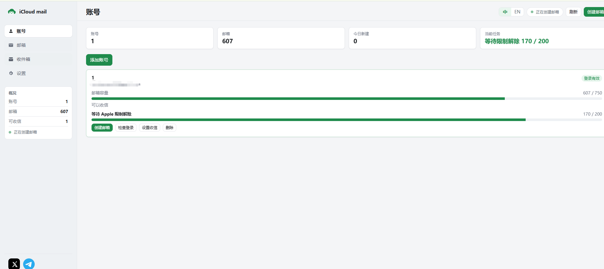

# iCloud mail

基于 iCloud Hide My Email，批量创建和管理 `@icloud.com` 隐私邮箱.

> 这是一个面向个人效率和内部管理场景的 Web 工具：统一管理多个 iCloud 主账号、创建隐私邮箱、查看收件内容，并为每个邮箱生成独立取件链接。请遵守 Apple 服务条款和适用法律，不要用于垃圾邮件、欺诈或未经授权的自动化操作。

## 界面预览

账号管理与创建状态：



## 功能

- **多账号管理** — 每个 Apple 账号独立 Cookie 和会话
- **批量创建** — 不同账号最多 5 个并行，同一账号逐个创建；碰到 Apple 临时限制时每次等待 1 分钟后自动续建
- **邮箱列表** — 分页、复制、导出 CSV / TXT、独立取件链接
- **收件箱** — 使用 Apple App 专用密码收信
- **自动创建** — 北京时间 7:00 到 20:00，每隔 60 到 90 分钟给每个有效账号创建 3 到 5 个邮箱；正在批量创建的账号会跳过

## 功能说明

### 多账号与 Cookie 会话

每个 iCloud 主账号独立保存 Cookie、Apple ID 和运行状态。添加账号后可以单独检查登录、查看当前隐私邮箱数量和剩余容量；删除账号时会同步清理该账号关联的取件链接、缓存和导出记录。

### 批量创建与限流保护

批量任务支持选择多个主账号并设置创建数量。相同主账号始终串行执行，避免并发请求互相冲突；不同主账号默认最多 5 路并行。检测到 Apple 临时限制时，任务会暂停并在等待窗口结束后自动继续，同时保留任务进度，服务重启后可以断点恢复。

### 邮箱、收件箱与取件链接

每个隐私邮箱都有独立的不可猜测取件链接。后台按主账号统一同步邮件，前端打开取件页时直接读取缓存中的最新内容；有新邮件时自动刷新，减少大量页面同时打开时对 iCloud 的重复请求。

### 导出与防重复

支持按账号和导出状态筛选隐私邮箱，导出 TXT 格式为“隐私邮箱----取件链接”。完成导出后邮箱会自动归类到“已导出”，避免重复导出和重复使用；需要时可以恢复为未导出状态。

## 联系方式

- X： [@fangao798](https://x.com/fangao798)
- Telegram： [联系我](https://t.co/fd6OPHgvKm)

## 前提条件

- iCloud+（Hide My Email 需要订阅）
- Python 3.10+

## 快速开始

```bash
pip install -r requirements.txt
python web_ui.py
```

浏览器打开 http://127.0.0.1:5050

1. 点「添加账号」。Chrome 安装 Cookie Editor，登录 icloud.com，导出 Header String 粘贴进去。
2. 到「设置」勾选账号、填写数量，点「开始创建」。
3. 若要收信，先给账号设置 App 专用密码。

Cookie Editor: https://chromewebstore.google.com/detail/cookie-editor/hlkenndednhfkekhgcdicdfddnkalmdm

默认只监听本机 127.0.0.1。若要监听 0.0.0.0，必须设置环境变量 `ADMIN_ACCESS_TOKEN`。

## 安全

- `accounts.json` 明文保存 Cookie 和收信密码，不要提交到 Git，也不要发给别人。
- 取件链接 `/pickup/<token>` 不需要登录，拿到链接就能读这封隐私邮箱，不要公开传播。
- 生产环境请设置 `ADMIN_ACCESS_TOKEN`，并通过 HTTPS 反代。

## 启动

```bash
python web_ui.py
python web_ui.py --port 8080
python web_ui.py --scheduler
```

环境变量: `HOST`、 `PORT`、 `ADMIN_ACCESS_TOKEN`、 `PICKUP_BASE_URL`

## 测试

```bash
pip install -r requirements-dev.txt
python -m pytest -q
```

## License

MIT
