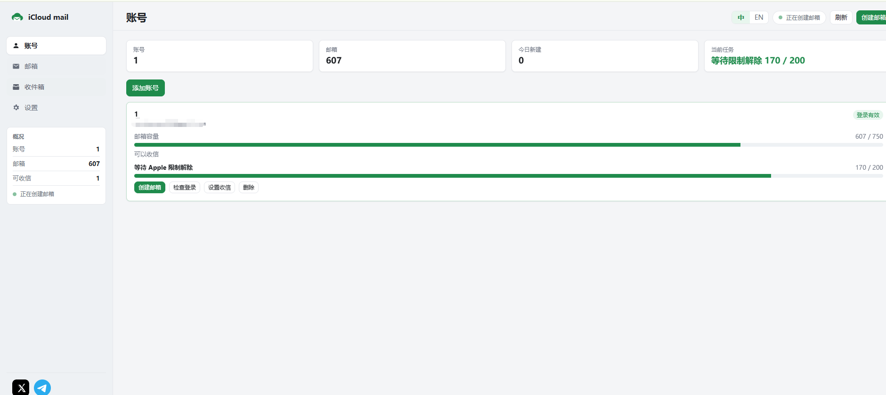

# iCloud 隐私邮箱管理工具

基于 Apple iCloud Hide My Email（隐藏邮件地址）的 Web 管理工具，提供多账号管理、隐私邮箱创建、收件查看、独立取件链接和导出管理等功能。

通过统一的网页界面，可以集中管理多个 iCloud 主账号，查看邮箱与任务状态，批量创建隐私邮箱，并为不同隐私邮箱生成独立的邮件查看链接。

> 本项目创建的是已有 Apple 账号下的隐藏邮件地址，**不是注册新的 Apple ID**。使用 Hide My Email 创建地址需要相应的 iCloud+ 权益，创建数量、频率及可用性仍受 Apple 服务限制。请遵守 Apple 服务条款和适用法律，不要用于垃圾邮件、欺诈或未经授权的自动化操作。

## 界面预览

账号管理与创建状态：



## 核心功能

### 多账号集中管理

- 添加和管理多个 iCloud 主账号，每个账号使用独立的 Cookie 与会话。
- 检查账号登录状态，查看隐私邮箱数量和运行状态。
- 重新导入 Cookie、更新收信凭据，无需删除后重新添加账号。
- 删除账号时同步清理关联的取件链接、邮件缓存、导出记录和任务引用，减少残留数据。

### 批量创建与任务控制

- 选择参与任务的主账号，设置每个账号的创建数量和邮箱标签。
- 不同主账号最多支持 10 路并行，同一个主账号串行创建。
- 查看总体进度，以及每个账号的成功数量、失败数量和异常原因。
- 支持暂停、继续和停止创建任务。
- 区分全部完成、部分成功和失败状态，避免把未达到目标的任务显示为全部成功。

### 异常保护与进度恢复

- 识别 Apple 临时限制、网络异常和认证失败等不同情况。
- 遇到已识别的 Apple 临时限制时，等待 30 分钟后再次尝试；等待结束不代表限制一定已解除。
- 对需要人工处理的异常账号暂停相关操作，避免持续重复请求。
- 保存批量任务进度，服务重启后可根据持久化状态恢复任务。
- 隔离单个账号的执行异常，降低其对其他账号任务的影响。

这些机制用于控制请求、保留进度和展示异常，不提供绕过 Apple 限制的能力。

### 定时自动创建

- 支持启用或停止自动创建功能。
- 默认在北京时间 07:00—20:00 的时间窗口运行。
- 每轮间隔约 60—90 分钟，每个有效账号随机创建 3—5 个隐私邮箱。
- 跳过正在执行批量创建的账号，减少任务冲突。
- 根据账号状态和限制情况调整后续执行。

实际创建结果取决于账号权益、登录状态、网络连接和 Apple 的服务限制。

### 邮件同步与收件查看

- 使用 Apple App 专用密码通过 IMAP 同步邮件。
- 按主账号统一同步和缓存邮件，减少多个页面同时打开时的重复请求。
- 在管理界面查看邮件列表和邮件内容。
- 支持按隐私邮箱查看关联邮件。
- 收信认证失败后暂停同步，并延迟复查；更新凭据后可尝试恢复。

隐私邮箱创建和邮件接收属于不同流程：能创建地址，不代表收信配置已经正常。

### 独立取件链接

- 为隐私邮箱生成带随机令牌的独立取件链接。
- 访问取件页面无需进入管理员后台。
- 查看对应隐私邮箱的邮件列表及内容。
- 页面通过后台缓存获取邮件，并支持刷新查看新邮件。
- 支持撤销取件链接。

取件链接属于访问凭证：任何拿到链接的人都可能查看对应邮箱的邮件，请仅向可信对象提供，不要公开发布。

### 邮箱列表与导出管理

- 分页查看、筛选和复制隐私邮箱。
- 支持 CSV、TXT 导出。
- 支持导出“隐私邮箱 + 取件链接”，TXT 格式为：

```text
隐私邮箱----取件链接
```

- 记录导出状态，区分已导出和未导出的邮箱，帮助减少重复导出。
- 支持将导出记录恢复为未导出状态。

### 安全与维护

- Cookie 和收信密码采用 AES-GCM 加密存储。
- 加密密钥独立保存在 `.credentials.key` 中。
- 提供管理员访问令牌配置，默认仅监听本机地址。
- 提供日志和 `/healthz` 健康检查接口，便于排查与部署维护。
- 提供面向现有 Linux 部署目录的备份脚本，支持 SQLite 快照及完整性检查。

## 适用场景

- 集中管理个人或内部使用的多个 iCloud 账号。
- 为不同网站或服务分配独立隐私邮箱。
- 查看不同隐私邮箱收到的邮件。
- 导出邮箱与取件链接，并管理导出状态。
- 在自托管环境中运行创建和收件管理任务。

## 联系方式

- X： [@fangao798](https://x.com/fangao798)
- Telegram： [联系我](https://t.co/fd6OPHgvKm)

## 前提条件

- iCloud+（Hide My Email 需要订阅）
- Python 3.10+

## 快速开始

```bash
pip install -r requirements.txt
python web_ui.py
```

浏览器打开 http://127.0.0.1:5050

1. 点「添加账号」。Chrome 安装 Cookie Editor，登录 icloud.com，导出 Header String 粘贴进去。
2. 到「设置」勾选账号、填写数量，点「开始创建」。
3. 若要收信，先给账号设置 App 专用密码。

Cookie Editor: https://chromewebstore.google.com/detail/cookie-editor/hlkenndednhfkekhgcdicdfddnkalmdm

默认只监听本机 127.0.0.1。若要监听 0.0.0.0，必须设置环境变量 `ADMIN_ACCESS_TOKEN`。

## 使用与安全提醒

本项目为非 Apple 官方工具，请遵守 Apple 服务条款及适用法律，不要用于垃圾邮件、欺诈或未经授权的操作。

公网部署应配置管理员访问令牌，并通过 HTTPS 反向代理提供访问。账号数据、凭据密钥、邮件缓存、取件令牌和备份文件均不应提交到公开仓库。

Cookie 和收信密码采用加密存储，但加密主要保护单独泄露的账号数据文件；如果数据和密钥同时泄露，或服务器本身被控制，凭据仍然存在风险。备份时必须保留 `.credentials.key`，且备份文件本身也需要妥善保护。

## 启动

```bash
python web_ui.py
python web_ui.py --port 8080
python web_ui.py --scheduler
```

环境变量: `HOST`、 `PORT`、 `ADMIN_ACCESS_TOKEN`、 `PICKUP_BASE_URL`

## 测试

```bash
pip install -r requirements-dev.txt
python -m pytest -q
```

## License

MIT
